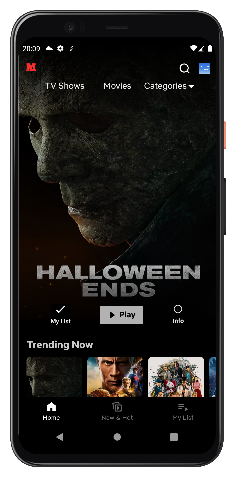
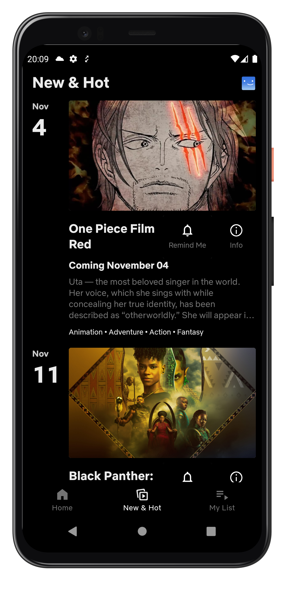
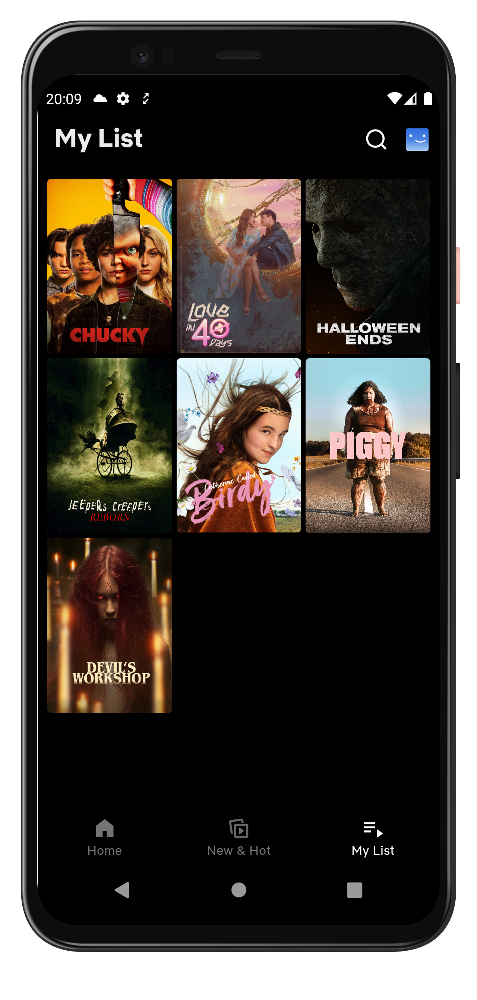
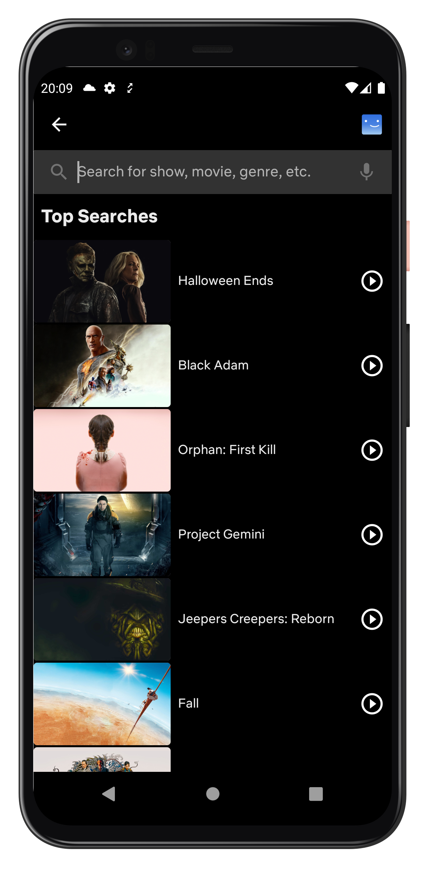
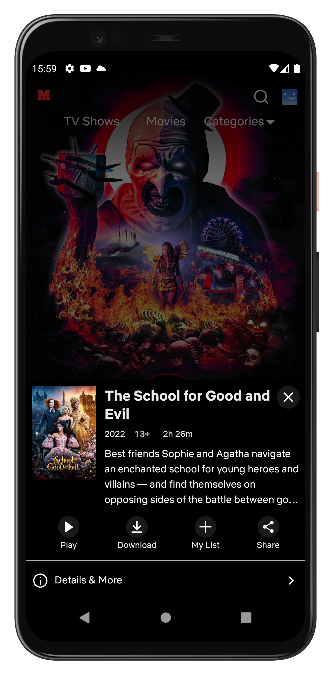
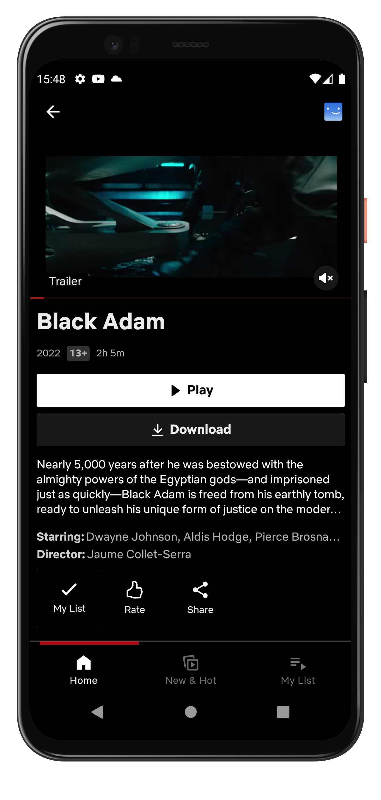

# Mome
Mome is movie application with MVVM (Model, View, ViewModel), LiveData, Navigation Component(NavGraph, BottomNav) consuming [TMDB API](https://www.themoviedb.org/documentation/api) to help users to have current information of the trending, popular, upcoming many other films.
Application support on [Mobile](https://play.google.com/store/apps/details?id=com.catelt.mome)

# Screenshot
|        Home Screen        |        New Screen        |       My List Screen        |
|:-------------------------:|:------------------------:|:---------------------------:|
|  |  |  |

|        Search Screen        |        Bottom Detail Screen        |        Detail Screen        |
|:---------------------------:|:----------------------------------:|:---------------------------:|
|  |  |  |

# Dependencies
- Firebase API 🔥:
    - [Firebase Authentication](https://firebase.google.com/docs/auth) - Login , Registration and Forgot Password.
    - [Firebase FireStore](https://firebase.google.com/docs/firestore) - Stores and queries users , products, favorite, cart items and order data.
    - [Firebase Storage](https://firebase.google.com/docs/storage) - Stores user profile pictures and product images.
    - [Firebase Cloud Messaging](https://firebase.google.com/docs/cloud-messaging) - Push notification
    - [Firebase Dynamic](https://firebase.google.com/docs/dynamic-links) - Share link product for everyone
    - [Firebase Distribute](https://firebase.google.com/docs/app-distribution/android/distribute-console) - Tester can test the application quickly
    - [Firebase Crashlytics](https://firebase.google.com/docs/crashlytics) - Check the bug of the application when the user uses it
- Jetpack components:
    - [Lifecycle](https://developer.android.com/topic/libraries/architecture/lifecycle)
    - [ViewModel](https://developer.android.com/topic/libraries/architecture/viewmodel)
    - [LiveData](https://developer.android.com/topic/libraries/architecture/livedata)
    - [Paging 3 library](https://developer.android.com/topic/libraries/architecture/paging/v3-overview)
- Other Libraries 📚:
    - [Navigation Component](https://developer.android.com/guide/navigation/navigation-getting-started)
    - [Material Component](https://material.io/components?platform=android)
    - [Coroutine](https://developer.android.com/topic/libraries/architecture/coroutines)
    - [Kotlin Flow](https://developer.android.com/kotlin/flow)
    - [Retrofit](https://square.github.io/retrofit)
    - [Moshi](https://github.com/square/moshi)
    - [Dagger Hilt](https://developer.android.com/training/dependency-injection/hilt-android)
    - [Coil](https://coil-kt.github.io/coil/)
    - [Splash Screen](https://developer.android.com/guide/topics/ui/splash-screen)
    - [Gson](https://github.com/google/gson)
    - [Timber](https://github.com/JakeWharton/timber)
